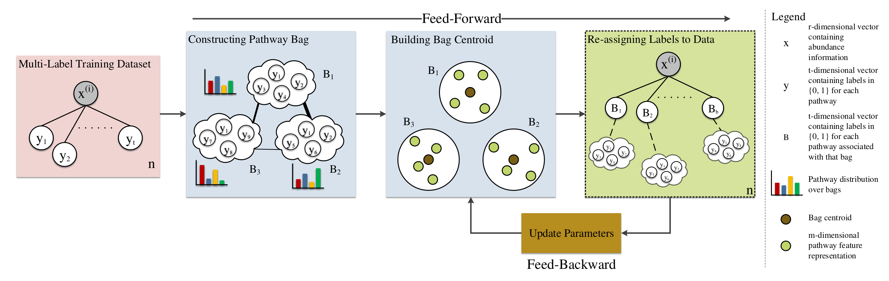

## Basic Description
This repo contains an implementation of reMap (**re**labeling **M**ulti-label dataset based on b**a**g a**p**proach) a simple, and yet, generic framework, that performs relabeling examples to a different set of labels, characterized as bags, where a bag is comprised of correlated pathways. To obtain bags, any models from [CBT](https://github.com/hallamlab/cbt.git) package can be employed. After obtaining bags, reMap preforms relabeling by alternating between 1) assigning bags to each sample (or feed-forward) and 2) updating reMap"s internal parameters (or feed-backward). reMap"s effectiveness were evaluated on metabolic pathway prediction (using [leADS](https://github.com/hallamlab/leADS.git)) where resulting performance metrics equaled or exceeded other prediction methods on organismal genomes with improved sensitivity score.

## Dependencies
The codebase is tested to work under Python 3.7. To install the necessary requirements, run the following commands:

``pip install -r requirements.txt``

Basically, *reMap* requires following packages:
- [Anaconda](https://www.anaconda.com/)
- [NumPy](http://www.numpy.org/) (== 1.18.5)
- [scikit-learn](https://scikit-learn.org/stable/) (== 0.23)
- [scipy](https://www.scipy.org/index.html) (==1.5.0)

## Experimental Objects and Test Samples
Please download the following files from [Zenodo](https://zenodo.org/record/3711138#.Xn2fgXVKjeQ). 
- The link contains the following preprocessed files:
    - "vocab.pkl": a set of 2526 pathways ("idx: metacyc pathway id").
    - "idxvocab.pkl": indices of 2526 pathways ("idx").
    - "hin.pkl": a sample of heterogeneous information network. 
    - "bag_pathway.pkl": grouping pathways to bags of size (200, 2526).
    - "pathway2vec_embeddings.npz": a sample of embeddings (22593, 128). Based on your tests, you need to generate features using [pathway2vec](https://github.com/hallamlab/pathway2vec).
    - "features.npz": extracted pathway features of size (2526, 128).
    - "phi.npz": distribution of pathways over bags of size (200, 2526).
    - "sigma.npz": bags covariance of size (200, 200).
    - "rho.npz": bags correlations of size (200, 200).
    - "centroid.npz": bags centroid of size (200, 128). 
- We also provided pretrained models and samples for testing:
    - "golden_X.pkl": Golden dataset of size (63, 3650). First six examples correspond to: AraCyc, EcoCyc, HumanCyc, LeishCyc, TrypanoCyc, and YeastCyc.
    - "golden_y.pkl": Golden dataset of size (63, 2526). First six examples correspond pathways to: AraCyc, EcoCyc, HumanCyc, LeishCyc, TrypanoCyc, and YeastCyc.
    - "golden_B.pkl": Golden dataset of size (63, 200). First six examples correspond pathways to: AraCyc, EcoCyc, HumanCyc, LeishCyc, TrypanoCyc, and YeastCyc.
    - "biocyc205_tier23_9255_X.pkl": BioCyc (v20.5 tier 2 \& 3) dataset of size (9255, 3650).
    - "biocyc205_tier23_9255_y.pkl": BioCyc (v20.5 tier 2 \& 3) dataset of size (9255, 2526).
    - "biocyc205_tier23_9255_B.pkl": BioCyc (v20.5 tier 2 \& 3) dataset of size (9255, 200).
    - "reMap.pkl": a pretrained reMap model using "biocyc205_tier23_9255_X.pkl" and "biocyc205_tier23_9255_y.pkl".

## Installation and Basic Usage
Run the following commands to clone the repository to an appropriate location:

``git clone https://github.com/hallamlab/reMap.git``

For all experiments, navigate to ``src`` folder then run the commands of your choice. For example, to display *reMap*'s running options use: `python main.py --help`. It should be self-contained.

### Preprocessing
To preprocess data, we provide few examples.

Description about arguments in all examples: *--define-bags* is a boolean variable indicating whether to construct bags, *--recover-max-bags* is a boolean variable indicating whether to recover an initial set of bags for each example, *--alpha* is a hyper-parameter for controlling bags centroids, *--top-k* is hyper-parameter to retrieve top k labels for each bag, *--v-cos* corresponds a cutoff threshold for consine similarity, *--hin-name* is the name for the heterogeneous information network file (e.g. "hin.pkl"), *--vocab-name* corresponds the name of the vocabulary (pathway set) file (e.g. "vocab.pkl"), *--bag-phi-name* is the name of the file indicating labels distribution over bags (e.g. "phi.npz"), *--bag-sigma-name* is the bags covariance file name (e.g. "sigma.npz"), *--features-name* corresponds the file name of the features (e.g. "pathway2vec_embeddings.npz"), *--file-name* corresponds the PREFIX name of generated files, and *--y-name* is the pathway space of multi-label data (e.g. "biocyc205_tier23_9255_y.pkl").

The results of running all the commands below will be stored in *--dspath* location. Several files will be generated (e.g. PREFIX + "bag_pathway.pkl") 

#### Example 1
To **construct bags**, execute the following command:

``python main.py --define-bags --alpha 16 --top-k 90 --hin-name "hin.pkl" --vocab-name "vocab.pkl" --bag-phi-name "phi.npz" --bag-sigma-name "sigma.npz" --features-name "pathway2vec_embeddings.npz" --file-name "biocyc" --mdpath "[path to the model]" --dspath "[path to the dataset]"``

#### Example 2
To **recover maximum set of bags**, execute the following command:

``python main.py --recover-max-bags --alpha 16 --v-cos 0.1 --file-name "biocyc" --y-name "biocyc205_tier23_9255_y.pkl" --dspath "[path to the dataset]"``

#### Example 3
If you wish to perform the above two examples, execute the following command:

``python main.py --define-bags --recover-max-bags --alpha 16 --top-k 90 --v-cos 0.1 --hin-name "hin.pkl" --vocab-name "vocab.pkl" --bag-phi-name "phi.npz" --bag-sigma-name "sigma.npz" --features-name "pathway2vec_embeddings.npz" --file-name "biocyc" --y-name "biocyc205_tier23_9255_y.pkl" --mdpath "[path to the model]" --dspath "[path to the dataset]"``

### Training
For trainning, we provide two examples. 

**Please** do not use "reMap.pkl" during this step, and change the name of the pretrained models or store them in a different folder to avoid conflict.

The results of running all the commands below will be stored in two locations: *--mdpath* which contains the trained model with additional files and *--rspath* which has the cost file.

#### Example 1
If you wish to randomly allocate bags for a given multi-label bag dataset (e.g. "biocyc205_tier23_9255_B.pkl") that is obtained from Example 2 or 3, execute the following command:

``python main.py --train --random-allocation --theta-bern 0.3 --yB-name "biocyc205_tier23_9255_B.pkl" --model-name "[file name (without extension)]" --dspath "[path to the store bags dataset]"``

where *--theta-bern* is a Bernoulli probability value for allocating bags randomly to either -1, or +1. 

#### Example 2
To train reMap given multi-label input data (e.g. "biocyc205_tier23_9255_X.pkl"), multi-label pathway data (e.g. "biocyc205_tier23_9255_y.pkl"), and multi-label bag dataset (e.g. "biocyc205_tier23_9255_B.pkl") that is obtained from Example 2 or 3, execute the following command:

``python main.py --train --calc-label-cost --alpha 16 --ssample-input-size 0.05 --ssample-label-size 50 --calc-subsample-size 50 --bags-labels "bag_pathway.pkl" --features-name "features.npz" --bag-centroid-name "bag_centroid.npz" --rho-name "rho.npz" --X-name "biocyc205_tier23_9255_X.pkl" --y-name "biocyc205_tier23_9255_y.pkl" --yB-name "biocyc205_tier23_9255_B.pkl" --file-name "biocyc" --model-name "[model name (without extension)]" --mdpath "[path to the model]" --dspath "[path to the dataset]" --rspath "[path to store the results (e.g. costs)]" --logpath "[path to the log directory] --batch 50 --num-epochs 3 --num-jobs 10``

where *--calc-label-cost* is a boolean variable indicating whether to estimate the cost of labels, *--alpha* is a hyper-parameter for controlling bags centroids, *--ssample-input-size* is the input subsample size, *--ssample-label-size* corresponds the maximum number of labels to be sampled, *--calc-subsample-size* is loss computed on selected samples, *--bags-labels* is the file name to bagging pathways (e.g. "bag_pathway.pkl"), *--features-name* corresponds the file name of the features (e.g. "features.npz"), *--bag-centroid-name* corresponds the file name of bags centroids (e.g. "bag_centroid.npz"), *--rho-name* is the file name of bags correlations (e.g. "rho.npz"), *--batch* is batch size, *--num-epochs* corresponds the number of iterations over the training set, *--num-jobs* corresponds the number of parallel workers, *--X-name* is the input space of a multi-label data (e.g. "biocyc205_tier23_9255_X.pkl"), *--y-name* is the pathway space of multi-label data (e.g. "biocyc205_tier23_9255_y.pkl"), and *--yB-name* is the bag space of a multi-label data (e.g. "biocyc205_tier23_9255_B.pkl") that is obtained from Example 2 or 3.

### Transforming
To transform a dataset (e.g. "golden_X.pkl") into bags using pretrained model, execute the following command:

``python main.py --transform --ssample-label-size 100 --bags-labels "bag_pathway.pkl" --features-name "features.npz" --bag-centroid-name "bag_centroid.npz" --rho-name "rho.npz" --X-name "biocyc205_tier23_9255_X.pkl" --y-name "biocyc205_tier23_9255_y.pkl" --file-name "[name of bag data excluding extension]" --model-name "[model name (without prefix and extension, e.g. "reMap.pkl")]" --mdpath "[path to the model]" --dspath "[path to the dataset]" --batch 50 --num-jobs 10``

where *--ssample-label-size* corresponds the maximum number of labels to be sampled, *--bags-labels* is the file name to bagging pathways (e.g. "bag_pathway.pkl"), *--features-name* corresponds the file name of the features (e.g. "features.npz"), *--bag-centroid-name* corresponds the file name of bags centroids (e.g. "bag_centroid.npz"), *--rho-name* is the file name of bags correlations (e.g. "rho.npz"), *--batch* is batch size, *--num-jobs* corresponds the number of parallel workers, *--X-name* is the input space of a multi-label data (e.g. "biocyc205_tier23_9255_X.pkl"), *--y-name* is the pathway space of multi-label data (e.g. "biocyc205_tier23_9255_y.pkl"), and *--file-name* is the PREFIX name of generated bag data (excluding extension).

## Citing
If you find *triUMPF* useful in your research, please consider citing the following paper:
- M. A. Basher, Abdur Rahman and Hallam, Steven J.. **["reMap: Relabeling  Metabolic Pathway Dataset with Bags to Enhance Predictive Performance."](https://doi.org/10.1101/2020.05.27.119826)**, bioRxiv (2020).

## Contact
For any inquiries, please contact: [arbasher@alumni.ubc.ca](mailto:arbasher@alumni.ubc.ca)
