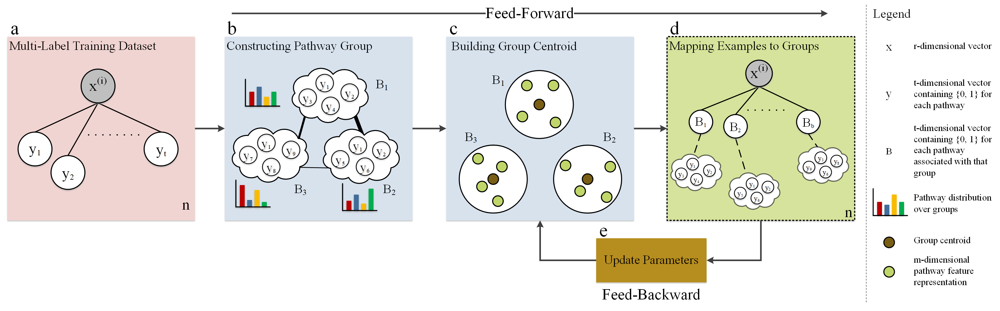

## Basic Description

This repo contains an implementation of reMap (**re**labeling **M**etabolic pathway d**a**ta with grou**p**s) a simple, and yet, generic framework, that performs relabeling examples to a different set of labels, characterized as pathway groups (or "bags"), where a group comprises with correlated pathways. To obtain groups, any models from [CHAP](https://github.com/hallamlab/chap.git) package can be employed. After obtaining groups, reMap preforms relabeling by alternating between 1) assigning groups to each sample (or feed-forward) and 2) updating reMap's parameters (or feed-backward). reMap's effectiveness were evaluated on metabolic pathway prediction (using [leADS](https://github.com/hallamlab/leADS.git)) where resulting performance metrics equaled or exceeded other prediction methods on organismal genomes with improved pathway prediction outcomes.

See tutorials on the [GitHub wiki](https://github.com/hallamlab/reMap/wiki) page for more information and guidelines.

## Citing

If you find *reMap* useful in your research, please consider citing the following paper:

- M. A. Basher, Abdur Rahman and Hallam, Steven J.. **["Relabeling metabolic pathway data with groups to improve prediction outcomes"](https://doi.org/10.1101/2020.08.21.260109)**, bioRxiv (2021).

## Contact

For any inquiries, please contact Steven Hallam and Abdurrahman Abul-Basher at: [shallam@mail.ubc.ca](mailto:shallam@mail.ubc.ca) and [arbasher@student.ubc.ca](mailto:arbasher@student.ubc.ca)
